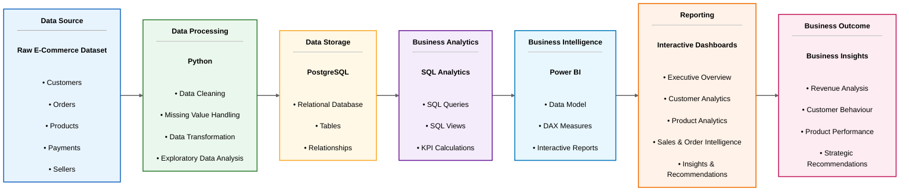
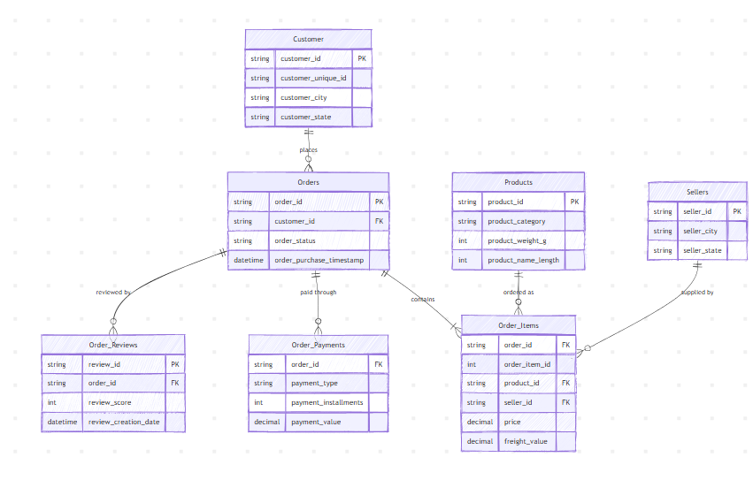

# 🛒 E-Commerce Business Performance Analytics

An end-to-end Business Performance Analytics project that transforms raw e-commerce transaction data into meaningful business insights using **Python, PostgreSQL, SQL and Power BI**.


---

## Project Overview

This project was developed to analyze the performance of an e-commerce business by transforming raw transactional data into meaningful business insights through interactive dashboards.

The project follows a complete analytics workflow, beginning with data cleaning and preprocessing in Python, followed by database design and SQL analysis in PostgreSQL. The processed data is then connected to Power BI to create interactive dashboards that provide insights into customers, products, sales performance, payment trends and delivery operations.

Rather than focusing only on dashboard creation, this project demonstrates the complete data analytics lifecycle—from raw data preparation to business reporting and strategic recommendations.

### Project Highlights

- Developed a complete end-to-end analytics solution using Python, PostgreSQL, SQL and Power BI.
- Cleaned and transformed raw e-commerce datasets for accurate analysis.
- Designed a relational PostgreSQL database and created SQL views for business reporting.
- Built five interactive Power BI dashboards using DAX measures and KPIs.
- Analyzed customer behavior, product performance, sales trends and operational efficiency.
- Generated actionable business insights and strategic recommendations.

---

## Table of Contents

- [Dashboard Preview](#dashboard-preview)
- [About the Project](#about-the-project)
- [Business Problem](#business-problem)
- [Project Objectives](#project-objectives)
- [Technology Stack](#technology-stack)
- [Project Architecture](#project-architecture)
- [Dataset Overview](#dataset-overview)
- [ETL Pipeline](#etl-pipeline)
- [Database Design](#database-design)
- [Dashboard Overview](#dashboard-overview)
- [Key Business Insights](#key-business-insights)
- [Repository Structure](#repository-structure)
- [Installation Guide](#installation-guide)
- [Future Enhancements](#future-enhancements)

---

## Dashboard Preview

The Power BI report consists of five interactive dashboards, each designed to analyze a different aspect of the e-commerce business. Together, these dashboards provide a comprehensive view of business performance, customer behavior, product performance, sales trends and operational efficiency.

### Executive Dashboard

Provides a high-level summary of business performance including revenue, orders, customers, average order value, monthly revenue trends and top-performing states and product categories.


---

### Customer Analytics Dashboard

Focuses on customer acquisition, repeat customers, geographical distribution and revenue contribution across different cities and states to better understand customer behavior.


---

### Product Analytics Dashboard

Analyzes product categories, seller performance, category-wise revenue contribution and product performance to identify high-performing products and growth opportunities.


---

### Sales & Order Intelligence Dashboard

Monitors sales trends, order volume, payment methods, delivery performance and operational KPIs to evaluate overall business efficiency.


---

### Insights & Recommendations Dashboard

Summarizes the overall analysis using business insights, Pareto analysis, decomposition analysis and strategic recommendations to support data-driven decision-making.


---

## About the Project

This project was built to analyze the performance of an e-commerce business by transforming raw transactional data into meaningful business insights. It follows the complete analytics lifecycle, from data preparation and database design to interactive dashboard development and business reporting.

Using publicly available e-commerce datasets, I developed an end-to-end analytics solution to answer important business questions related to customers, products, sales performance, payment behavior, and delivery operations. The objective was not only to visualize business performance but also to uncover trends, identify opportunities and generate insights that support better business decisions.

The project begins with raw e-commerce datasets, which are cleaned and prepared using **Python**. The processed data is then stored in **PostgreSQL**, where SQL is used to create tables, views and business queries for reporting. Finally, the data is connected to **Power BI**, where interactive dashboards are developed using DAX measures to monitor key business metrics.

The final solution consists of five interactive dashboards that provide a comprehensive view of business performance, helping stakeholders monitor revenue, customer behavior, product performance, sales trends, payment preferences and delivery efficiency from a single reporting platform.

---

## Business Problem

E-commerce businesses process thousands of customer orders, payments and product transactions every day. While this data contains valuable information, it is often spread across multiple datasets, making it difficult to gain a complete view of business performance.

Without a centralized analytics solution, decision-makers may struggle to answer important business questions such as:

- Which product categories generate the highest revenue?
- Which states and cities contribute the most to overall sales?
- How are revenue and order volumes changing over time?
- Which payment methods are most preferred by customers?
- How efficient is the order delivery process?
- Which products and sellers contribute the most to business growth?
- What business areas require improvement to increase revenue and customer satisfaction?

To address these challenges, this project brings together data from multiple e-commerce datasets into a single reporting solution. The final dashboards provide stakeholders with a clear view of business performance, enabling them to monitor key metrics, identify trends, evaluate operational efficiency and make informed business decisions with confidence.

---

## Project Objectives

The primary objective of this project was to build an end-to-end business analytics solution that converts raw e-commerce data into meaningful insights for business decision-making. The project focuses on transforming raw business data into meaningful insights through data cleaning, SQL analysis, and interactive dashboard reporting.

The project was designed to:

- Clean and preprocess raw e-commerce datasets to ensure data quality and consistency.
- Design a structured PostgreSQL database for efficient data storage and querying.
- Perform SQL-based analysis to extract meaningful business insights.
- Develop interactive Power BI dashboards to monitor key business performance indicators (KPIs).
- Analyze customer behavior, purchasing patterns, and geographic sales distribution.
- Evaluate product category performance and seller contributions to overall revenue.
- Monitor sales trends, payment preferences and order delivery performance.
- Identify business trends, growth opportunities and operational improvement areas.
- Present insights through intuitive visualizations that support data-driven decision-making.
- Deliver strategic recommendations based on analytical findings.

---

## Technology Stack

The project was developed using a combination of programming, database and business intelligence tools to support the complete analytics workflow.

| Technology | Role in the Project |
|------------|------------------------|
| **Python** | Cleaned and preprocessed raw e-commerce datasets, handled missing values, standardized data formats and performed exploratory data analysis (EDA). |
| **Pandas** | Used for data manipulation, cleaning, merging datasets and feature engineering. |
| **NumPy** | Supported numerical operations and data transformations during preprocessing. |
| **PostgreSQL** | Stored the cleaned data in a structured relational database for efficient querying and reporting. |
| **SQL** | Created tables, views and analytical queries to extract meaningful business insights and prepare reporting datasets. |
| **Power BI** | Developed interactive dashboards, KPIs and visualizations for business performance analysis. |
| **DAX** | Created calculated measures and KPIs to support dynamic reporting and dashboard interactivity. |
| **Visual Studio Code** | Primary IDE used for Python scripting, SQL development and project management. |
| **pgAdmin 4** | Managed the PostgreSQL database, executed SQL scripts and validated query results. |
| **Git & GitHub** | Used for version control, repository management and project documentation. |

---

## Project Architecture

The project follows a structured end-to-end analytics workflow that transforms raw e-commerce transaction data into meaningful business insights. Each stage of the pipeline prepares, processes, and enriches the data before passing it to the next stage, ensuring reliable analysis, interactive reporting, and data-driven decision-making.


---

## Dataset Overview

The project is based on the **Brazilian E-Commerce Public Dataset (Olist)**, which contains transactional data from a multi-category online marketplace. The dataset captures the complete customer purchasing journey, from order placement and payment to product delivery and customer reviews.

The original dataset consists of multiple related CSV files, each representing a different business entity. These datasets were cleaned, transformed and merged into a unified analytical dataset for SQL analysis and Power BI reporting.

### Source Datasets

| Dataset | Description |
|----------|-------------|
| **Customers** | Customer details, unique customer identifiers and location information. |
| **Orders** | Order lifecycle, purchase timestamps, delivery status and shipping dates. |
| **Order Items** | Product-level information for each order, including seller details and item pricing. |
| **Order Payments** | Payment methods, installment information and payment values. |
| **Order Reviews** | Customer review scores and review timestamps. |
| **Products** | Product categories and product attributes. |
| **Sellers** | Seller information and geographic locations. |
| **Geolocation** | Customer and seller location data based on ZIP codes. |
| **Product Category Translation** | Translation of Portuguese product category names into English. |

### Final Dataset Summary

After data cleaning and transformation, the individual datasets were merged into a single analytical dataset that was used for SQL analysis and Power BI dashboard development.

| Attribute | Value |
|-----------|------:|
| **Source Dataset** | Olist Brazilian E-Commerce Dataset |
| **Number of Source Files** | 9 CSV Files |
| **Final Dataset Size** | **118,434 Rows × 33 Columns** |
| **Primary Business Domain** | E-Commerce |
| **Analysis Period** | September 2016 – August 2018 |

---

## ETL Pipeline

The project follows a structured ETL (Extract, Transform, Load) pipeline that converts raw e-commerce transaction data into a clean, structured and analytics-ready dataset. Each stage of the workflow ensures data quality, consistency and efficient reporting, enabling accurate business analysis and interactive dashboard development.

### ETL Workflow

| Phase | Process | Tools Used |
|--------|---------|------------|
| **Extract** | Imported nine raw CSV datasets containing customer, order, product, payment, seller and review information. | Python, Pandas |
| **Transform** | Cleaned missing values, standardized column names and data types, merged related datasets, created new features and performed exploratory data analysis (EDA). | Python, Pandas, NumPy |
| **Load** | Loaded the processed dataset into PostgreSQL by creating relational tables and importing cleaned data. | PostgreSQL, pgAdmin 4 |
| **Analyze** | Developed SQL queries and analytical views to calculate KPIs and prepare datasets for business reporting. | SQL, PostgreSQL |
| **Visualize** | Connected PostgreSQL to Power BI, built the data model, created DAX measures and developed interactive dashboards. | Power BI, DAX |

### ETL Process Summary

1. Imported raw e-commerce datasets into Python.
2. Cleaned and preprocessed the data by handling missing values and correcting data formats.
3. Merged related datasets into a unified analytical dataset.
4. Performed exploratory data analysis (EDA) to validate data quality and identify business trends.
5. Loaded the processed dataset into PostgreSQL.
6. Created relational tables and analytical SQL views.
7. Connected PostgreSQL to Power BI.
8. Developed DAX measures, KPIs and interactive dashboards for business reporting.

---

## Database Design

A relational PostgreSQL database was designed to store the cleaned e-commerce data and support efficient analytical querying. The database structure enables data integrity, minimizes redundancy and provides a scalable foundation for business reporting and dashboard development.

The cleaned datasets were imported into PostgreSQL, where relational tables were created using primary and foreign key relationships. SQL queries and analytical views were then developed to prepare reporting datasets for Power BI.

### Database Components

| Component | Purpose |
|-----------|---------|
| **Raw Tables** | Store the cleaned transactional data imported from Python. |
| **Relational Tables** | Organize customer, order, product, seller and payment data using structured relationships. |
| **SQL Views** | Simplify complex business queries and prepare reporting datasets. |
| **Analytical Queries** | Calculate KPIs, revenue metrics, customer insights and sales trends. |
| **Reporting Layer** | Provide optimized datasets for Power BI dashboards. |

### Entity Relationship Diagram

The PostgreSQL database was designed using a relational schema that models the key entities of the e-commerce business, including customers, orders, products, sellers, payments and reviews. The relationships between these entities ensure data integrity, reduce redundancy and enable efficient SQL analysis for business reporting and Power BI dashboard development.

<p align="center">
  
</p>

### Key Database Features

- Designed a relational database schema for efficient data storage.
- Created normalized tables to reduce data redundancy.
- Established relationships between business entities using primary and foreign keys.
- Developed SQL views to simplify business reporting.
- Executed analytical SQL queries to calculate KPIs and business metrics.
- Connected PostgreSQL to Power BI for real-time querying and interactive dashboard development.

---
## Dashboard Overview

The final Power BI solution consists of five interactive dashboards that provide a comprehensive view of business performance. Each dashboard focuses on a specific business area, enabling stakeholders to monitor KPIs, identify trends and make data-driven decisions.

---

### 1. Executive Dashboard

Provides a high-level summary of the overall business performance through key performance indicators, revenue trends and top-performing categories.

**Key Highlights**
- Total Revenue
- Total Orders
- Total Customers
- Average Order Value
- Monthly Revenue Trend
- Top Customer States by Revenue
- Top Product Categories by Revenue

<p align="center">
  
</p>

---

### 2. Customer Analytics Dashboard

Focuses on customer acquisition, repeat customers, geographical distribution and revenue contribution across different cities and states.

**Key Highlights**
- Total Customers
- New vs Repeat Customers
- Top Revenue City
- Customer Composition
- Top Customer Cities
- Top Customer States
- Revenue Contribution by State

<p align="center">
  
</p>

---

### 3. Product Analytics Dashboard

Analyzes product categories, seller performance and category-wise revenue to identify high-performing products and growth opportunities.

**Key Highlights**
- Total Product Categories
- Total Sellers
- Top Product Category
- Top Seller Share
- Category Revenue Analysis
- Seller Performance
- Category Revenue Distribution
- Category Performance Matrix

<p align="center">
  
</p>

---

### 4. Sales & Order Intelligence Dashboard

Monitors order performance, delivery efficiency, payment preferences and monthly sales trends to evaluate operational performance.

**Key Highlights**
- Total Orders
- Average Delivery Days
- Late Delivery Percentage
- Most Used Payment Method
- Monthly Orders Trend
- Orders vs Revenue Trend
- Payment Method Distribution
- Order Status Distribution
- On-Time Delivery Performance

<p align="center">
  
</p>

---

### 5. Insights & Recommendations Dashboard

Summarizes key analytical findings and provides actionable business recommendations to support strategic decision-making.

**Key Highlights**
- Revenue Contribution Analysis
- Pareto Analysis
- Executive Insights
- Strategic Recommendations
- Business Growth Opportunities

<p align="center">
  
</p>

---

## Key Business Insights

The analysis uncovered several important trends across sales performance, customer behavior, product demand and operational efficiency. These insights can help stakeholders make informed business decisions and identify opportunities for growth.

### Revenue & Sales Performance

- Generated **15.86M** in total revenue from **99.44K** customer orders.
- Revenue exhibited a steady upward trend throughout the analysis period, with peak sales observed during seasonal shopping periods.
- The average order value remained stable at **159.47**, indicating consistent customer purchasing behavior.

---

### Customer Insights

- São Paulo (SP) contributed the highest share of total revenue, making it the strongest regional market.
- Most customers were first-time buyers, while repeat customers represented a relatively small percentage, highlighting an opportunity to improve customer retention.
- Revenue was concentrated across a few major cities, suggesting the potential for geographical market expansion.

---

### Product & Seller Performance

- A small number of product categories generated a significant share of overall revenue, as highlighted by the Pareto Analysis.
- Categories such as **Beauty & Health**, **Watches & Gifts** and **Bed, Bath & Table** consistently ranked among the highest revenue contributors.
- Seller revenue distribution indicated that only a limited number of sellers contributed substantially to total sales, presenting opportunities to strengthen mid-performing sellers.

---

### Payment & Delivery Insights

- Credit Card was the most preferred payment method, accounting for the majority of completed transactions.
- **92.38%** of customer orders were delivered on time, indicating strong logistics performance.
- Late deliveries represented a relatively small percentage of total orders but remain an area for continuous operational improvement.

---

### Business Recommendations

- Revenue concentration within a limited number of product categories suggests opportunities for product diversification.
- Improving customer retention through loyalty programs and personalized marketing could increase repeat purchases.
- Expanding high-performing categories while supporting emerging categories can create sustainable long-term growth.
- Monitoring delivery performance and seller efficiency can further enhance customer satisfaction and operational excellence.

---
## Repository Structure

```text
E-Commerce-Business-Performance-Analytics/
│
├── Architecture/
│   ├── Architecture.png
│   └── README.md
│
├── Dashboard Screenshots/
│   ├── 01_Executive_Dashboard.png
│   ├── 02_Customer_Analytics.png
│   ├── 03_Product_Analytics.png
│   ├── 04_Sales_Order_Intelligence.png
│   ├── 05_Insights_Recommendations.png
│   └── README.md
│
├── Database_Design/
│   ├── er_diagram.png
│   └── README.md
│
├── Dataset/
│   ├── README.md
│   ├── olist_customers_dataset.csv
│   ├── olist_orders_dataset.csv
│   ├── olist_order_items_dataset.csv
│   ├── olist_order_payments_dataset.csv
│   ├── olist_order_reviews_dataset.csv
│   ├── olist_products_dataset.csv
│   ├── olist_sellers_dataset.csv
│   ├── product_category_name_translation.csv
│   ├── olist_marketing_qualified_leads_dataset.csv
│   └── olist_closed_deals_dataset.csv
│
├── Power BI/
│   ├── README.md
│   └── E-Commerce-Business-Performance-Analytics.pbix
│
├── Python/
│   ├── README.md
│   ├── 01_data_cleaning.py
│   ├── 02_orders_analysis.py
│   ├── 03_payments_analysis.py
│   ├── ...
│   └── 14_seller_concentration_analysis.py
│
├── SQL/
│   ├── README.md
│   ├── 01_average_delivery_time.sql
│   ├── 02_late_delivery_percentage.sql
│   ├── ...
│   └── 14_view_category_revenue.sql
│
├── .gitignore
└── README.md
```

The repository is organized into dedicated folders for datasets, Python ETL scripts, SQL business queries, Power BI dashboards, database design, architecture diagrams and dashboard screenshots. Each folder contains its own README file to explain its purpose and contents, making the project easier to navigate and understand.

---

## Dataset Access

Most of the datasets used in this project are available directly in the **Dataset** folder of this repository.

Due to GitHub's web upload size limitations, the following datasets could not be uploaded directly:

| Dataset | Reason |
|---------|--------|
| `master_ecommerce_dataset.csv` | Final analytical dataset generated during the ETL process (large file). |
| `olist_geolocation_dataset.csv` | Original Olist geolocation dataset (large file). |

To ensure the repository remains complete, both datasets are available through the Google Drive folder below.

### Google Drive

**Dataset Download Link**

👉 **https://drive.google.com/drive/u/3/folders/1ETrzZhfke-oO3XVl1mlV0l3j34CKimpZ**

The folder contains:

- `master_ecommerce_dataset.csv`
- `olist_geolocation_dataset.csv`

These files can be downloaded and placed inside the `Dataset` folder to recreate the complete project locally.

---
## Installation Guide

Follow the steps below to set up and explore the project locally.

### 1. Clone the Repository

```bash
git clone https://github.com/Noelchannayil/E-Commerce-Business-Performance-Analytics.git
```

---

### 2. Navigate to the Project Folder

```bash
cd E-Commerce-Business-Performance-Analytics
```

---

### 3. Install Python Dependencies

Install the required Python libraries:

```bash
pip install pandas matplotlib
```

---

### 4. Configure PostgreSQL

- Create a PostgreSQL database.
- Import the generated analytical dataset.
- Execute the SQL scripts located in the `SQL/` folder to create analytical views.

---

### 5. Run the Python ETL Pipeline

Execute the Python scripts in sequence:

```
01_data_cleaning.py
↓
02_orders_analysis.py
↓
03_payments_analysis.py
↓
...
↓
08_master_dataset.py
↓
...
14_seller_concentration_analysis.py
```

---

### 6. Open the Power BI Dashboard

Open the `.pbix` file using **Microsoft Power BI Desktop**.

Refresh the data source if required.

---

### 7. Explore the Repository

The repository contains dedicated documentation for every stage of the project:

- Architecture
- Dataset
- Python ETL
- SQL Analysis
- Database Design
- Dashboard Screenshots
- Power BI Dashboard

---

### 8. Review the Complete Analytics Workflow

Explore the project sequentially to understand the complete analytics lifecycle—from raw e-commerce data and ETL processing to PostgreSQL modeling, SQL analysis, interactive Power BI dashboards and business insights.

## Future Enhancements

While this project demonstrates a complete end-to-end business analytics workflow, there are several opportunities for future improvements:

- Integrate real-time data pipelines for live business performance monitoring.
- Deploy interactive dashboards using Power BI Service for online reporting and collaboration.
- Build predictive models to forecast sales, customer demand and revenue trends.
- Develop customer segmentation using machine learning techniques.
- Add advanced business KPIs and drill-through dashboard functionality.
- Automate the ETL pipeline using workflow orchestration tools.
- Expand the database schema to support inventory, supplier and marketing analytics.
- Create executive reports with automated alerts and scheduled dashboard refreshes.
